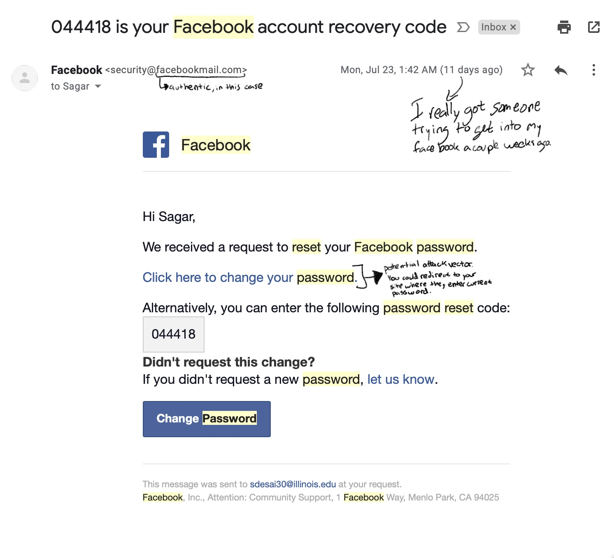
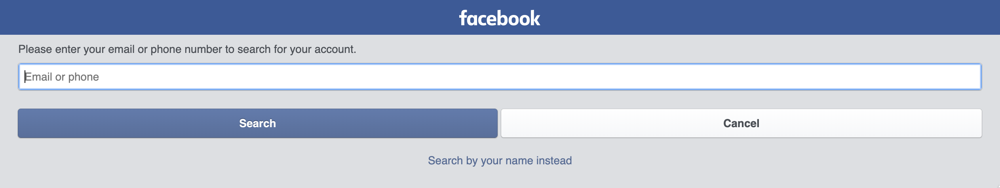
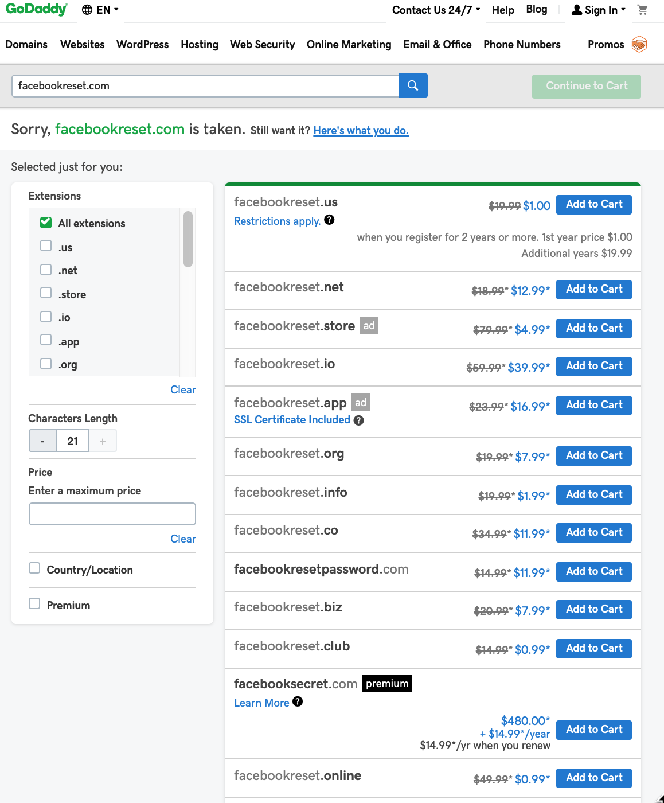

##How to hack into a two factor secured site.

Lets preface this by saying you should not do this, it is definitely not legal, and it reflects poorly on you if you get caught. I'm going over this purely as a learning exercise, to understand potential attack surfaces, adversaries, attack vectors, and ways to mitigate your risk.

So, lets do this.

First, lets set up our hypothetical scenario. Say you want to hack into someone's facebook account, how would you do it? Some of the places from which you could launch the attack could be--the login process, the password reset process, among others. Someone you know may want to try to get into your account, or someone from around the world might be trying to get into your account to access your private info, perhaps to clone the content, then delete, then ask for a ransom. There could be any number of reasons why you could be targeted (even if you aren't famous).

####Here's an authentic email I got for a password reset a couple weeks ago from facebook: 

In a phishing attack, you would receive an email that adopts the same look and feel of this email, but from a different address, and perhaps other minor changes. I've commented on the image above as to what might look different. The next thing you'd do is look at the password reset page on facebook, and create a website that emulates the look and feel of this reset page. 

####Here's the facebook password reset page:

The next thing you would do is buy a domain name that looks authentic, I went to GoDaddy and found that a number of domain names could potentially work, see the picture below to see what may work best.

####Potential domain names that would fool our target user:

