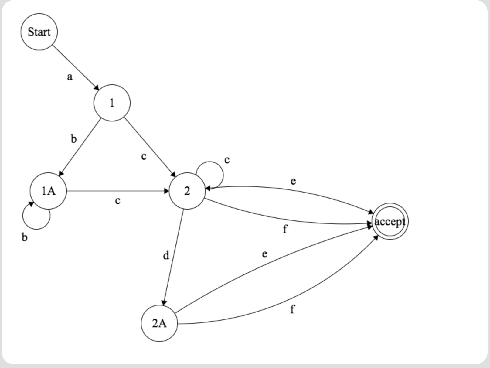
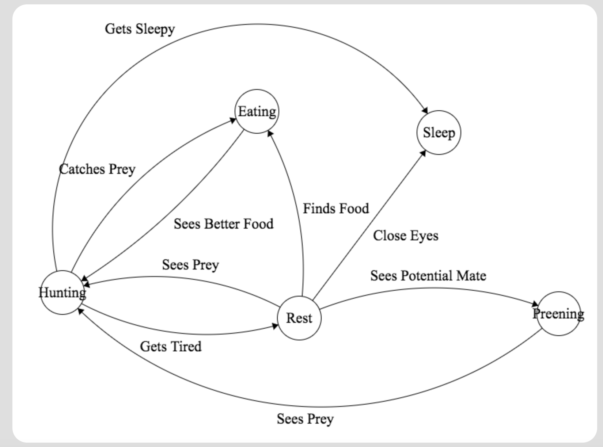

## Regular Expressions

1. Regex: /\w+ \w+ \w+/g

2. Regex: /[gm]\w+/g

3. Regex: /[\d\-]+/g

## State Machine

### ab*c+d?[ef] State Machine

### Lion State Machine

### VT-100 Terminal State Machine

1. ESC[12;45f

Regex: /\e\[[\d\;\w]+/g

2. ESC[1m

Regex: /\e\[[1]m/g
