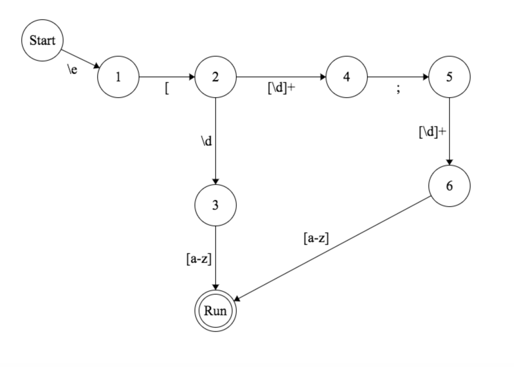

## Regular Expressions

1. Regex: /antelopes? rocks? out/g

2. Regex: /[gm]oat/g

3. Regex: /\d{1,4}\-\d{1,2}-\d{1,2}/g

## State Machine

### ab*c+d?[ef] State Machine

### Lion State Machine

### VT-100 Terminal State Machine

1. ESC[12;45f

Regex: \e\[[\d]+\;[\d]+f

2. ESC[1m

Regex: /\e\[1m/g

3. VT-100 Terminal State Machine

Regex: /\e\[[\d\;]+[a-z]/g

