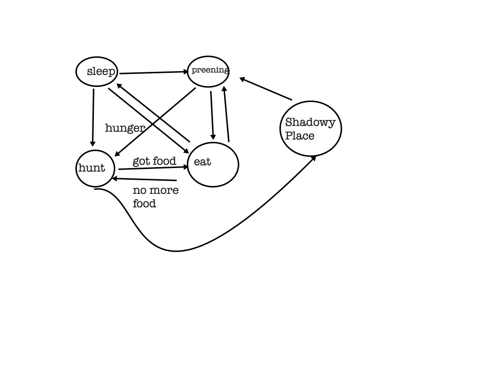
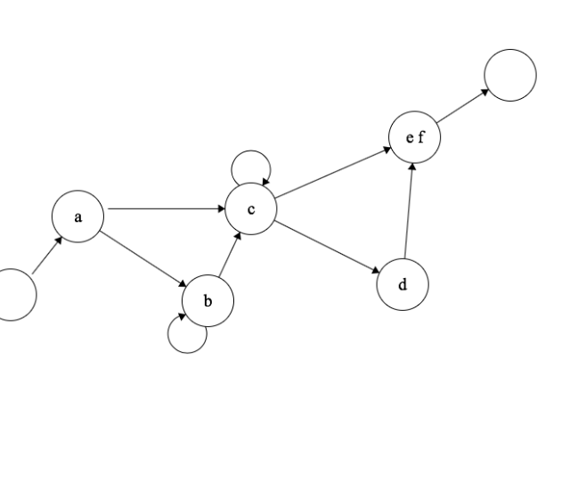
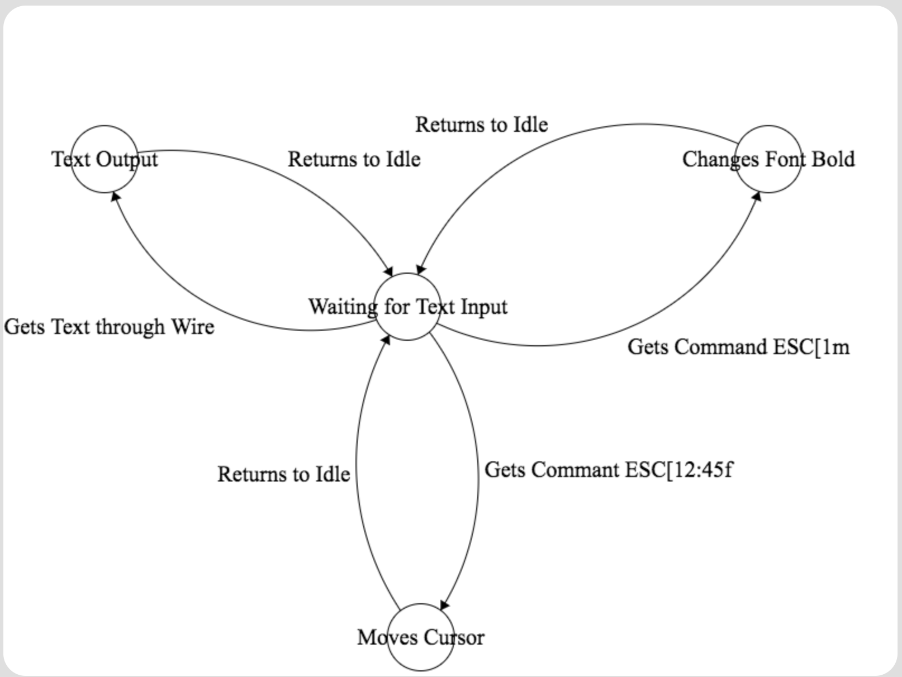

## Regex

### catches antelope and antelopes

\b(antelope)s? (rock)s? out\b[ig]

### catches moat and goat but no boat

\b[gm]oat\b[igm]

### date format

\b(\d{1,4})-(\d{1,2})-(\d{1,2})*\s

## State Machines

Lion state machine 

Not-lion state machine 

### VT100

//ESC[12;45f

/\e\[(\d+\;\d+f)/g 

// ESC[1m

/\e\[(\dm)/g 

state machine 

